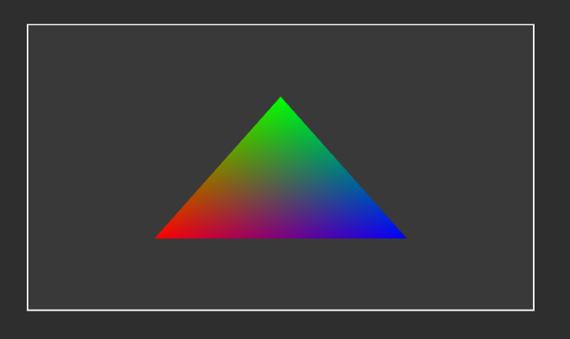

## C++ for wasm with WebGL

This project uses Clang to compile C++ to wasm.
With that, the C++ (wasm) code will be able to communicate with JS to use WebGL.

As for external or additional libraries and code, this project uses [OpenLibm](https://openlibm.org) as an alternative to the standard math library (./src/openlibm/) and [Max Klein's malloc implementation for wasm](https://github.com/maxkl/wasm-malloc) (./src/utils/include/malloc.hpp & ./src/utils/src/malloc.cpp). No others at this point in time.

To run the project on windows, use the `run.cmd` file.
To run it on linux, use `run.sh`.

You can check out the results [here](https://beprosto.github.io/wasm-webgl/public/)! :D

Here's how a triangle made using this looks like:

